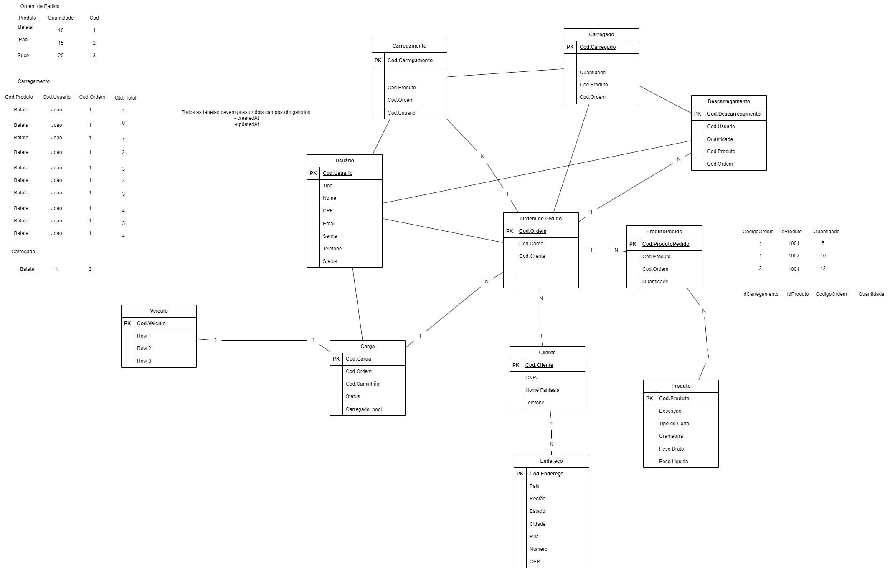

## Pré-requisitos
- Node.js instalado
- PostgreSQL instralado, configurado e em execução
- Prisma instalado e configurado para conectar com o banco de dados

## Instalação
1. Clone o repositório
    + Body git clone https://github.com/usuario/countboxes-api.git

## Métodos
Requisições para a API devem seguir os padrões:
| Método | Descrição |
|---|---|
| `GET` | Retorna informações de um ou mais registros. |
| `POST` | Utilizado para criar um novo registro. |
| `PUT` | Atualiza dados de um registro ou altera sua situação. |
| `DELETE` | Remove um registro do sistema. |

## Respostas

| Código | Descrição |
|---|---|
| `200` | A solicitação foi bem-sucedida.|
| `201` | A solicitação foi bem-sucedida e, como resultado, um novo recurso foi criado.|
| `400` | O servidor não pode ou não irá processar a solicitação devido a algo que é percebido como um erro do cliente. Provavelmente um dado foi passado errado.|
| `500` | O servidor encontrou uma situação que não sabe como lidar.|
